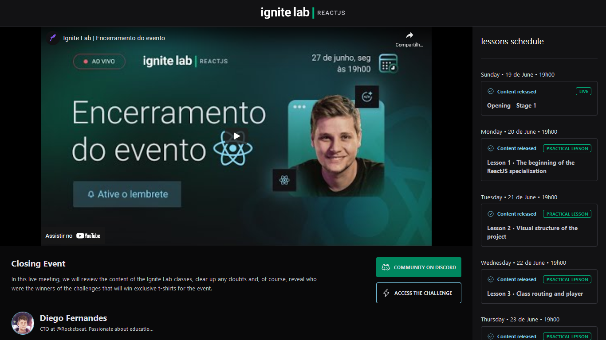

# Ignite Lab



## ✨ Tecnologias

- [Vite](https://vitejs.dev/)
- [Typescript](https://www.typescriptlang.org/)
- [React](https://reactjs.org/)
- [Eslint](https://eslint.org/)
- [React Router](https://reactrouter.com/)
- [Graphql](https://graphql.org/)
- [Apollo](https://www.apollographql.com/)
- [Graphql Code Generator](https://www.graphql-code-generator.com/)
- [Date Fns](https://date-fns.org/)
- [Phosphor React](https://phosphoricons.com/)
- [Tailwindcss](https://tailwindcss.com/)
- [Graphcms](https://graphcms.com/)

## 💻 Projeto

## Como executar

Clone o projeto e acesse sua pasta

```bash
$ git clone https://github.com/wendson13/ignite-lab.git
$ cd Ignite Lab
```

Instale as dependências e execute o projeto com yarn ou npm

```bash
# instalar dependências
$ yarn
  ou
$ npm i

# executar o projeto
$ yarn dev
  ou
$ npm run dev
```
acesse o projeto em [localhost:3000](http://localhost:3000) em seu navegador.

## 📌 Layout

layout usado no projeto no link abaixo

- [layout web](https://www.figma.com/community/file/1120711251998877938)

## 📝 License

Esse projeto está sob a licença MIT. Veja [LICENSE](LICENSE) para mais detalhes.